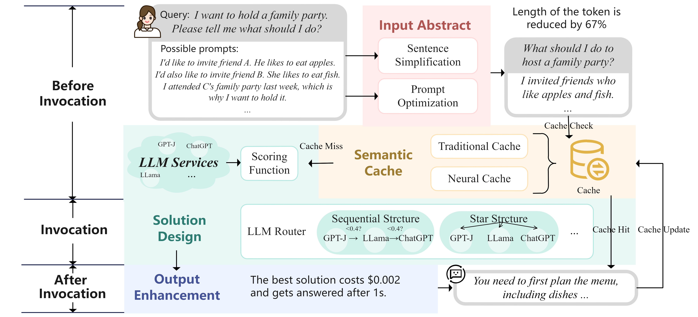

# A Survey on Effective Invocation Methods of Massive LLM Services

    <a href = "https://arxiv.org/pdf/2402.03408.pdf">Arxiv</a> | <a href = "./Paperlist.md">PaperList</a> | <a href = "./README.md">Readme</a>   | <a href = "./Resource.md">Resource</a>

***

  

Figure 1: Vision of efficient invocation strategy construction for massive LLM services.

 

Considering the heterogeneity in pricing does not necessarily correlate with the user experience, it is a great need to explore effective invocation methods for LLM services in practice. As shown in Figure 1, we expect to make use of massive LLM services to construct an effective invocation strategy according to different methods, meeting targets in different scenarios.
To this end, we attempts to provide a comprehensive study of the development and recent advances
on effective invocation methods in LMaaS. In detail, We first formalizes the task of constructing effective invocation strategy as 
a multi-objective optimization problem. This entails simultaneous consideration of latency, performance, and cost factors. Then, we propose a taxonomy to provide a unified view on effective invocation methods in LMaaS where the existing methods are categorized into: input abstract, semantic cache, solution design, and output enhancement. These four components can be flexibly combined and unified in a flexible framework. Finally, we highlight the challenges and potential directions and hope our work can provide a useful roadmap for beginners interested in this area and shed light on future research.

The contributions of this survey can be concluded as follows:
- As shown in <a href = "./Paperlist.md">PaperList</a>, a taxonomy of effective invocation methods in LMaaS is proposed, which categorizes existing methods from four different aspects: input abstract, semantic cache, solution design and output enhancement.
- As shown in Figure 2, the framework can unify the four type components, allowing each of them to work independently or simultaneously, during the life cycle of the LLM service invocation.
- To facilities the methods of this task, the price rules of popular LMaaS products is present in Table.~\ref{price} and the paper list of existing works is available. \footnote{\url{https://github.com/W-caner/Effective-strategy-for-LMaas}}

 

  

  Figure 2: LLM services invocation framework, shown by the phase of invocation.

 

Before invocation, the user enters a query $q$, and we consider that in general, $q$ consists of a question and multiple possible prompts. Where the question represents the user's goal, and the prompts are optional information to help accomplish the goal.

Here, we give an example where a user wants to know the answer of "I want to hold a family party. Please tell me what should I do?". And gave three possible prompts, related to the taste of friends and the motivation to host the party.

The processing of the input query $q$ to express more meaningful information in a more concise language is the first step to construct an effective invocation strategy. The methods in this aspect are summarized as **input abstract**  which is divided into **sentence simplification** and **prompt optimization** according to the different ways. The former reduces the latency $f_l$ and cost $f_c$ by simplifying the query without changing its semantics. The latter is used to improve the prompts for better performance $f_p$.

For example, here we filter out the "I attend C's family party..." prompt that is irrelevant to the question and shorten the token length of the input query by 67%.

**Semantic cache** is also an important strategy to improve service performance, reduce latency and cost before invocation, which is divided into **traditional cache** and **neural cache** according to different structures. It checks whether there is a semantically similar query in the cache, if so, it directly returns, otherwise it goes into the invocation phase.

**Solution design** aims to construct the best invocation solution $s$ by leveraging the complementary capabilities of massive LLM services. It evaluates LLM services $LLM_i$ with a given query $q$, and the method of evaluation is called **scoring function**. It is often done before the invocation, such as an estimate of $f_c$ can be used to guide the design of a low-cost solution. And in the invocation phase, the scoring function is used to guide the organized routing between services, which is called **LLM router**. Through different routing structures, the advantages of different services are utilized to build a satisfactory solution for users.

After invocation, **output enhancement** focuses on the information returned to the user. The output $\tilde{a}$ is adjusted to suit different targets and returned in a suitable form. In addition, the input and output of this invocation are stored in the semantic cache for future invocations.

Through the establishment of a taxonomy, we categorize existing methods into four categories: input abstract, semantic cache, solution design, and output enhancement. 
Then we formalize the problem of effective LLM services strategy construction, and propose a LLM services invocation framework. Each component in the framework can work independently or simultaneously to form effective strategy for LLM service invocation that are low-latency, high-performance, and cost-saving.

  

  Figure 3: A simple invocation strategy composed of existing methods, using Prompt Reducer in input abstract, Zep in semantic cache, FrugalGPT in solution design, and nothing in output enhancement.

 

Existing methods tend to focus on only one component of the framework, and we can use them as plugins. A case is shown in Figure 3, a simple invocation strategy constructed from three existing methods. The development prospects of this field are promising. We look forward to future research further advancing the field, providing users with low-latency, high-performance, and cost-effective LLM services solution, and promoting the healthy development of the LMaaS ecosystem.

